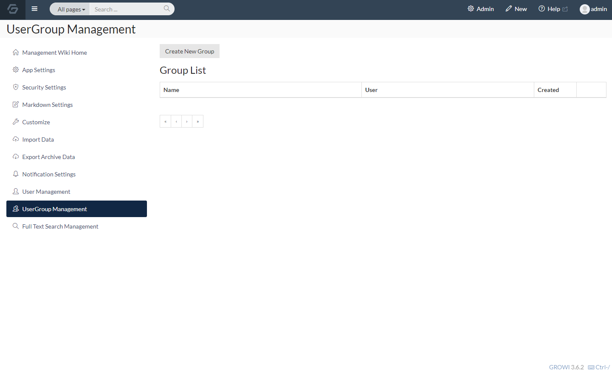
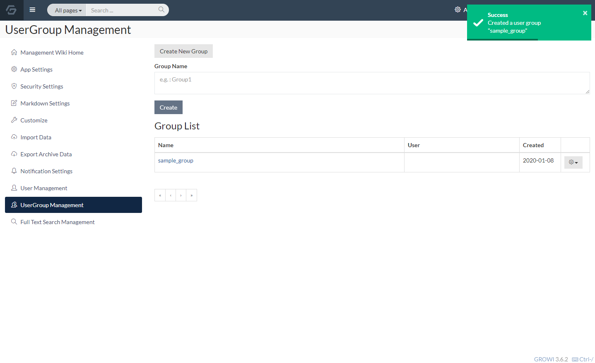
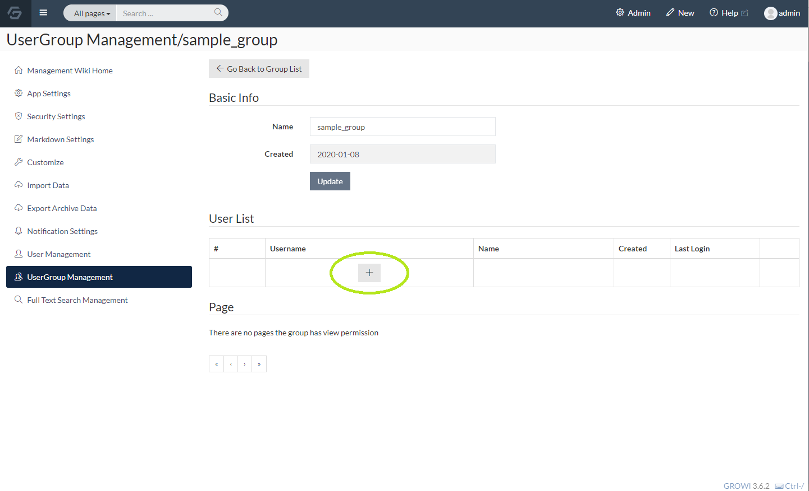
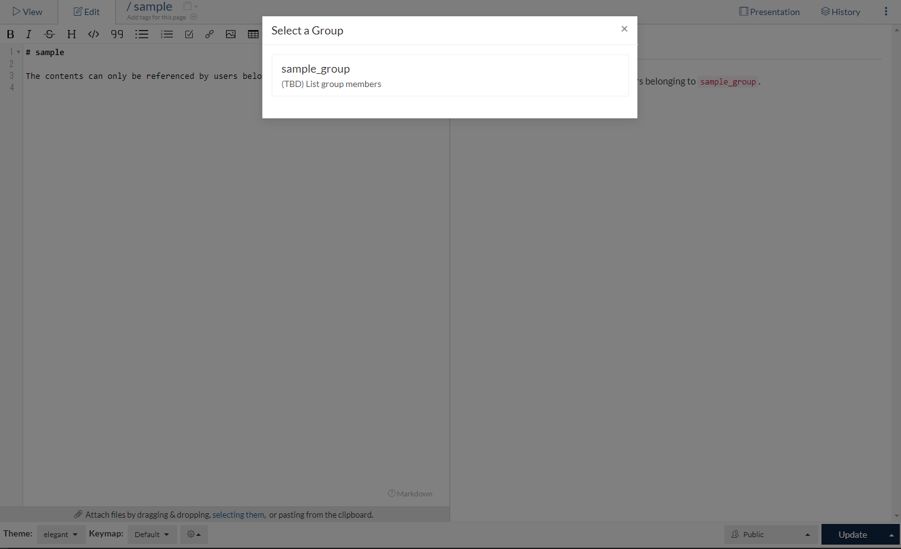
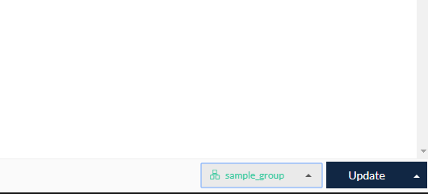
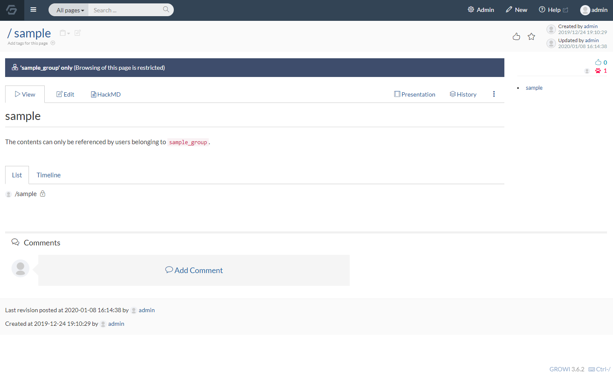
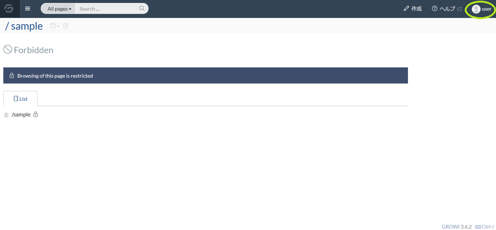

# UserGroup Management

By using the UserGroup Management function,
you can set the authority
that only specific users can view and edit the contents on a page basis.

To set a group,
you need to operate from the administration menu as a user with administrator authority.

## Create group

Go to "UserGroup Management" in the administration menu.

Click the "Create New Group" button first,
then enter the group name and click the "Create" button.

Success is displayed and the group is added to the Group List.

## Adding users to groups

Select a group displayed in the Group List.

Users can be added to the group by operating the user list on the group settings.

Click the "+" in the Username field
to display the entry field for adding a user to the group.

Enter the user name registered as a user in GROWI.

An error will occur as shown in the below image
and the user cannot be added to the group,
if the user name is not a registered user name.

## Set browsing permissions for pages

After the group is created, set the view / edit authority on the page.

In the page edit mode, set "Only inside the group" as shown in the image below.

Then, the group selection menu is displayed and you can select the created group.

Select the target group and click the Create / Update button.

The authority setting is completed, if you see the notation
that the authority is added at the top of the page like the image.

If you refer to the page with an account that does not belong to the group,
you will not be able to view or edit the contents of the page.

## Refer to the list of authorization pages on the group management page

When you set read / edit authority for a page,
you can see a list of pages for which authority have been set for the target group.

