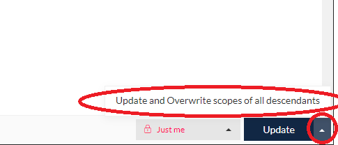

# Set page view / edit authority

GROWI users can be set so that only authorized users can view and edit the page.

This section describes the authority that can be set for pages.

## How to set view / edit authority for pages

In the edit mode of the page,
click the "▲" enclosed in red line of the below image first,
then the options are displayed as shown in the image below.

After selecting this option,
click the "Create / Update" button view / edit authority for the page apply.

## Types that can be set as view / edit authority

You can select any of the following for the contents
that can be set as page view / edit restrictions.

### Public

  There is no viewing or editing restriction for pages with this setting.
  Anyone can view and edit. This is the default.

  If the entire GROWI is `settings that cannot be viewed without logging in`,

  Even if the page is public,
  you will not be able to view or edit it unless you log in,
  and if you access the page, you will be redirected to the login page.

  Anyone who is logged in can view and edit.

### Anyone with the link
  
  Pages with this setting will not be output to the page list or page search results.

  Only users who know the URL of the page will be able to view and edit it.

  If you do not know where to place the page,
  follow the page from "Recently Created" on the home page.

  If it is a page you created, it will be output to this page list.

### Just me

  Pages with this setting cannot be viewed or edited by anyone other than yourself.

  Whether it is displayed in page list and page search results of other users
  can be set by ON / OFF of the management page.

  By default, it appears in the page list and page search results.

### Only inside the group

  Pages with this setting can only be viewed and edited by users
  belonging to the set group.

  Whether it is displayed in page list and page search results of a user not in group
  can be set by ON / OFF of the management page.

  By default, it appears in the page list and page search results.

## About group management function

Click [here](/en/admin-guide/management-cookbook/group.md) for details

## Control search results and list display for authorized pages

If you don't want to show a page to someone
who doesn't have view / edit authority when viewing search results or page list,
let's switch on / off function of the corresponding setting
in `Security setting` of management menu.

### Page listing/searching restricted by 'Just Me'

- Case with ON

  The list of pages of other users and search results
  will show the pages that have the restriction.

- Case with OFF

  The page with the restriction
  is not displayed in the list display or search results of the pages of other users.

### Page listing/searching restricted by User Group

- Case with ON

  The list of pages of users who do not belong to the group and search results
  will show the pages that have the restriction.

- Case with OFF

  Pages that have the restriction
  are not displayed in the list display or search results
  of users who do not belong to the group.

## Set viewing and editing authority at once under the page

Pages have a hierarchical structure,
and you may want to manage permissions for all pages under a specific page at once.

In that case, please click "▲" of "Create / Update" button
Appears in the lower right corner of the screen when in edit mode.

Click "Update and Overwrite scopes of all descendants".

By this operation,the same authority settings can be applied
to all pages under the corresponding page.

## Setting example of authority

Pages that require viewing / editing authority
can be easily managed by putting them together.

Move the pages that need authority as shown in the following example,
if there is no problem with changing the page structure.

- Create a group name page

- Move the page that you want to have view / edit authority
  only for that group under that page

  Click [here](/en/guide/features/page_operation.md) for page move

- Set authority for group name pages at once
