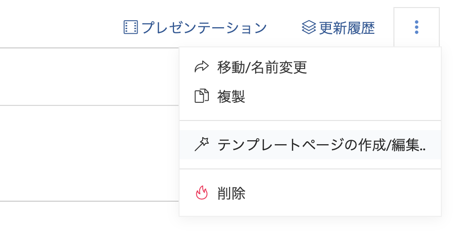
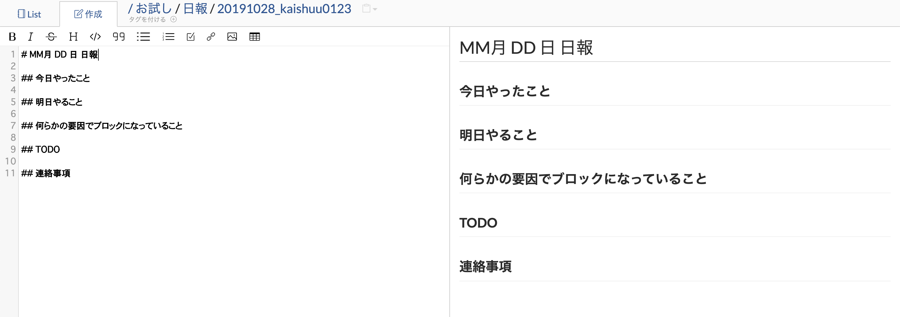

# Use page templates to make page creation easier


In GROWI, you can create a page using a template.

By using a template, you can easily create pages that are regularly required, such as daily reports (diaries), bug reports, and minutes of meetings.

Here is an example of creating a daily report template.

## Create a template page



From the page toolbar, select Create / Edit Template Page.


Select "Same Hierarchy Template" from the displayed dialog.

Then paste the following content and save the page.


```markdown
# MM Month DD Daily

## What I did today

## Things to do tomorrow

## Block for some reason

## TODO

## Message
```

A template page that has a fixed form is now created.

## Create a page with a template applied

Next, create a new page in the same level as the template page.


Then, the page is created with the template applied as shown below.

Change to the edit screen as needed.



## How to use lower layer template

If you want to create a regular page, you can use the “same hierarchy template” introduced earlier.

On the other hand, lower layer templates can be used when you want to unify the format of the entire GROWI wiki.

For example, by placing the following template on the top page, you can create a page that can always display the page list at the top of the page.

The notation `$lsx()` is from [weseek/growi-plugin-lsx](https://github.com/weseek/growi-plugin-lsx).

```markdown
# Related pages

$lsx()

#
```
