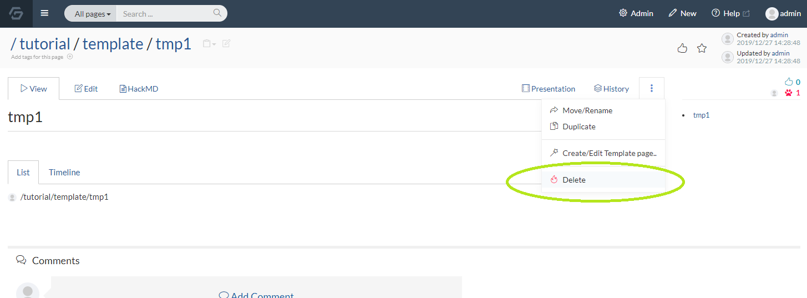
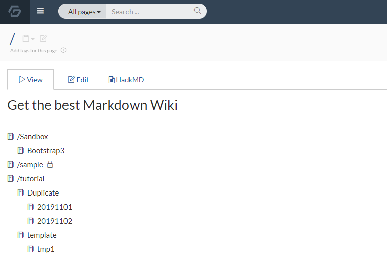
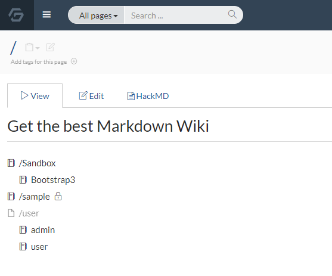

# delete page

As the page creation progresses, you also want to delete the page.

Delete unnecessary pages and clean up the wiki.

## Delete one page

Go to the target page you want to delete
and select the delete menu shown in the image below.

In the delete menu,

- Delete child pages recursively.

- Delete Completely

each has the check box.

By default, the first one is selected.

Let's press the "Delete" button on the page that has no child pages.

move to the page with the trash can mark at the top of the hierarchy with the message.

`This page is in the trash.`

After deletion, the page can no longer be referenced from the previous hierarchy.

## Check deleted pages in Trash

You can refer to the deleted page from
"Deleted pages" in the menu that appears by clicking the user name in the header.

The page moves below "/trash", keeping the original page hierarchy.

If you select the deleted page,
you will see the page, "Put Back" button, and "Delete Completely" button.

Deleted pages cannot be edited.
Click "Put Back" first if you want to edit.

## Delete completely

By clicking "Delete completely" under "/trash", pages can be permanently deleted.

Or, if you delete the page with the check box for "Delete Completely",
pages can be permanently deleted.

## Delete child pages recursively

All pages under the certain page can be deleted at once.

Let's check the page list before deleting.

Select the "Tutorial" page first,
then delete with "Delete child pages recursively" checked.

Then everything under the tutorial page will be deleted.

"Page is not found" is displayed, if you try to browse the "/tutorial" page,
after deleting completely.

As you can see from the list of pages on the top page,
if you delete the "Tutorial" page, the pages below the Tutorial page are also deleted.

Make use of the delete function to further develop GROWI.
