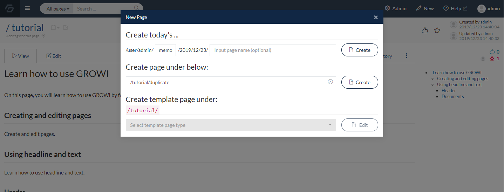
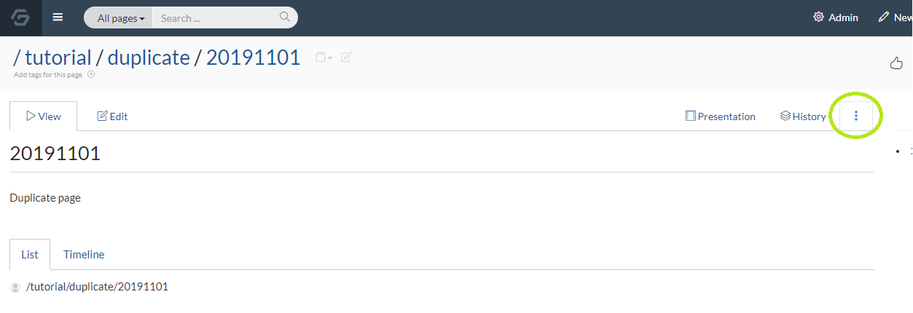
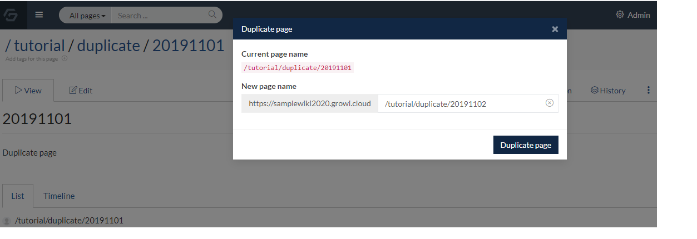
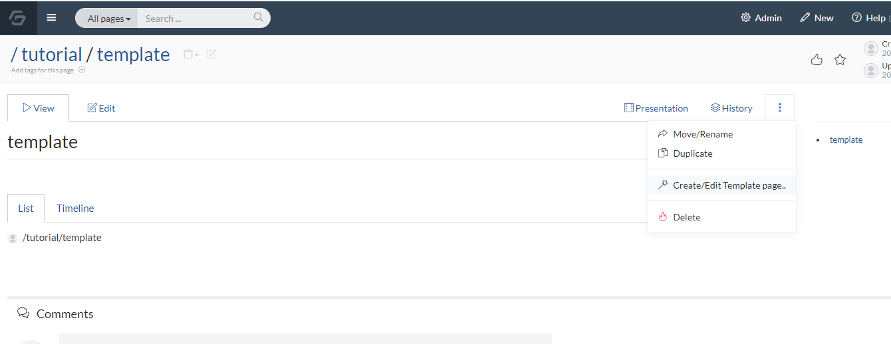
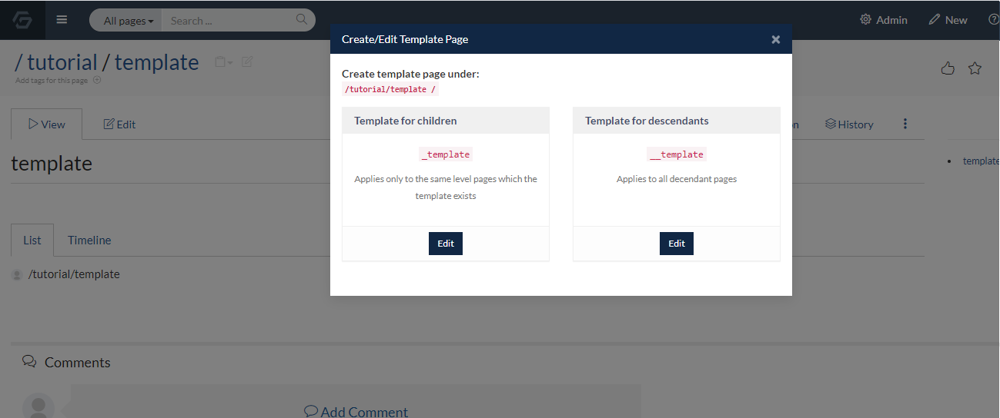
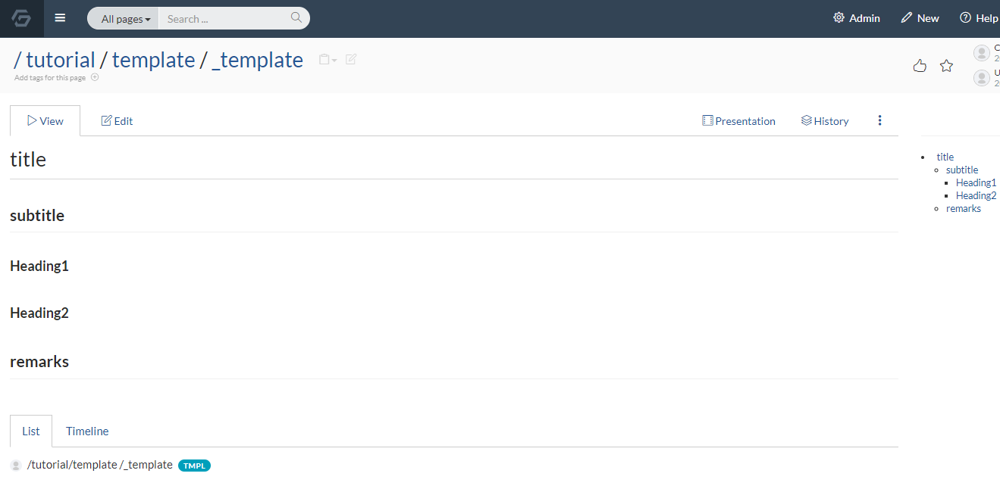

# duplicate page

When you can create a page, learn how to duplicate a page.

If you have a page that you use repeatedly,
understanding the mechanism of replication and templates can be very useful.

## After the tutorial of creating a page

First, create a page for creating a hierarchy in order to duplicate the page.

Press the "Create" button on a guide page, such as a tutorial page,
let's create a duplicate page.





## Duplicate page

Under the duplicate page, create a page for "20191101" that will be the copy source.

Create a page and paste the following markdown description.


```
# 20191101

Duplicate page
```

After that, click “Duplicate” in the image menu on the “20191101” page.





Enter the page name “20191102” and click the “Duplicate page” button.




The page will be duplicated like the image below.


By duplicating the page this way,
you can easily create a wiki page with copied contents.

Next, let's use a template function similar to the one described above.

## Create a template

Template is a function
that allows you to assign a fixed description when creating a new page.


There are two types of templates: Template for children and Template for descendants.


When you create "Template for children",
it applies only to the hierarchy where the template page exists.


When you create "Template for descendants",
it applies to all lower-level pages that have template pages.


Here, we use "Template for children".




Click the create template button as shown in the image
to enter the template selection field.

Click the Edit button on "Template for children".
Then, the page creation screen with the page name “_template” will appear.



On this screen, paste the following markdown description and save the page.

```
# title
## subtitle
### Heading1
### Heading2
## remarks
```



This completes the template creation.

Next, we will introduce how to actually use the created template.

## Create a page under a page with a template

On the page where the template was created,
click “Create” to create the page.


Then, the settings already made in the template are reflected
immediately after creating the page.


This can be very useful when creating repeated pages.

Let's think about the operation of templating by all means and build a wiki efficiently.
